author: Chandra Nayak & Madeline Lee
id: Visual_analytics_powered_by_snowflake_and_tableau
summary: TastyByte Analytics Powered by Snowflake and Tableau
categories: Getting-Started
environments: web
status: Published
feedback link: https://github.com/Snowflake-Labs/sfguides/issues
tags: Data Engineering, Data Collaboration, Geospatial Data

# Visual Analytics powered by Snowflake and Tableau

Duration: 30

<!-- ------------------------ -->

## Overview

Join Snowflake and Tableau for an instructor-led hands-on lab to build governed, visual, and interactive analytics quickly and easily.
### Prerequisites

* Familiarity with Snowflake and Tableau
* Familarity with using an IDE

### What You’ll Learn

* Load semi-structured data from external stage 
* Incorporate Weather and Geospatial data from Snowflake Marketplace
* Integrate and deliver multi-tenant tables and views in Snowflake.
* Build visual, intuitive, and interactive data visualizations powered by live data in Snowflake.

### What You’ll Need

* A [Snowflake](https://trial.snowflake.com/) account or free trial
* A [Tabelau Online](https://www.tableau.com/products/online/request-trial) account or free trial
*   [Visual Studio Code](https://code.visualstudio.com/download) editor

### What You’ll Build

* Snowflake objects in Raw,Harmonized, and Analytics layer
* A simple Tableau dashboard to present data from Snowflake

<!-- ------------------------ -->

## Snowflake Configuration

Duration: 2

1. Create a Snowflake enterprise trial account
2. Login to your Snowflake account
3. We will be using the new UI to get started but you can also switch over to the Classic Console if you would like.

### New Login UI

 

<!-- ------------------------ -->

## Managing Semi-Structured Data

Duration: 5

### Download Demo SQL Script

[To skip individual command download tb_introduction_vhol.sql & create Worksheet to run SQL file](tb_introduction_vhol.sql).

 

### Create Snowflake Objects

```sql
-- Create Database, Schema, Warehouse and Roles

USE ROLE sysadmin;

-- create frostbyte_tasty_bytes database
CREATE OR REPLACE DATABASE frostbyte_tasty_bytes;

-- create raw_pos schema
CREATE OR REPLACE SCHEMA frostbyte_tasty_bytes.raw_pos;

-- create raw_customer schema
CREATE OR REPLACE SCHEMA frostbyte_tasty_bytes.raw_customer;

-- create harmonized schema
CREATE OR REPLACE SCHEMA frostbyte_tasty_bytes.harmonized;

-- create analytics schema
CREATE OR REPLACE SCHEMA frostbyte_tasty_bytes.analytics;

-- create warehouses
CREATE OR REPLACE WAREHOUSE demo_build_wh
    WAREHOUSE_SIZE = 'xxxlarge'
    WAREHOUSE_TYPE = 'standard'
    AUTO_SUSPEND = 60
    AUTO_RESUME = TRUE
    INITIALLY_SUSPENDED = TRUE
COMMENT = 'demo build warehouse for frostbyte assets';
    
CREATE OR REPLACE WAREHOUSE tasty_de_wh
    WAREHOUSE_SIZE = 'xsmall'
    WAREHOUSE_TYPE = 'standard'
    AUTO_SUSPEND = 60
    AUTO_RESUME = TRUE
    INITIALLY_SUSPENDED = TRUE
COMMENT = 'data engineering warehouse for tasty bytes';

CREATE OR REPLACE WAREHOUSE tasty_bi_wh
    WAREHOUSE_SIZE = 'xsmall'
    WAREHOUSE_TYPE = 'standard'
    AUTO_SUSPEND = 60
    AUTO_RESUME = TRUE
    INITIALLY_SUSPENDED = TRUE
COMMENT = 'business intelligence warehouse for tasty bytes';
-- create roles
USE ROLE securityadmin;

-- functional roles
CREATE ROLE IF NOT EXISTS tasty_admin
    COMMENT = 'admin for tasty bytes';
    
CREATE ROLE IF NOT EXISTS tasty_data_engineer
    COMMENT = 'data engineer for tasty bytes';

CREATE ROLE IF NOT EXISTS tasty_bi
    COMMENT = 'business intelligence for tasty bytes';

-- role hierarchy
GRANT ROLE tasty_admin TO ROLE sysadmin;
GRANT ROLE tasty_data_engineer TO ROLE tasty_admin;
GRANT ROLE tasty_bi TO ROLE tasty_admin;

```

### Grant Privileges on Snowflake Objects

```sql
-- privilege grants
USE ROLE accountadmin;
GRANT IMPORTED PRIVILEGES ON DATABASE snowflake TO ROLE tasty_data_engineer;
GRANT CREATE WAREHOUSE ON ACCOUNT TO ROLE tasty_admin;

USE ROLE securityadmin;
GRANT USAGE ON DATABASE frostbyte_tasty_bytes TO ROLE tasty_admin;
GRANT USAGE ON DATABASE frostbyte_tasty_bytes TO ROLE tasty_data_engineer;
GRANT USAGE ON DATABASE frostbyte_tasty_bytes TO ROLE tasty_bi;

GRANT USAGE ON ALL SCHEMAS IN DATABASE frostbyte_tasty_bytes TO ROLE tasty_admin;
GRANT USAGE ON ALL SCHEMAS IN DATABASE frostbyte_tasty_bytes TO ROLE tasty_data_engineer;
GRANT USAGE ON ALL SCHEMAS IN DATABASE frostbyte_tasty_bytes TO ROLE tasty_bi;

GRANT ALL ON SCHEMA frostbyte_tasty_bytes.raw_pos TO ROLE tasty_admin;
GRANT ALL ON SCHEMA frostbyte_tasty_bytes.raw_pos TO ROLE tasty_data_engineer;
GRANT ALL ON SCHEMA frostbyte_tasty_bytes.raw_pos TO ROLE tasty_bi;

GRANT ALL ON SCHEMA frostbyte_tasty_bytes.harmonized TO ROLE tasty_admin;
GRANT ALL ON SCHEMA frostbyte_tasty_bytes.harmonized TO ROLE tasty_data_engineer;
GRANT ALL ON SCHEMA frostbyte_tasty_bytes.harmonized TO ROLE tasty_bi;

GRANT ALL ON SCHEMA frostbyte_tasty_bytes.analytics TO ROLE tasty_admin;
GRANT ALL ON SCHEMA frostbyte_tasty_bytes.analytics TO ROLE tasty_data_engineer;
GRANT ALL ON SCHEMA frostbyte_tasty_bytes.analytics TO ROLE tasty_bi;

-- warehouse grants
GRANT ALL ON WAREHOUSE demo_build_wh TO ROLE sysadmin;
GRANT OWNERSHIP ON WAREHOUSE tasty_de_wh TO ROLE tasty_admin REVOKE CURRENT GRANTS;
GRANT ALL ON WAREHOUSE tasty_de_wh TO ROLE tasty_admin;
GRANT ALL ON WAREHOUSE tasty_bi_wh TO ROLE tasty_admin;
GRANT ALL ON WAREHOUSE tasty_bi_wh TO ROLE tasty_bi;

-- future grants
GRANT ALL ON FUTURE TABLES IN SCHEMA frostbyte_tasty_bytes.raw_pos TO ROLE tasty_admin;
GRANT ALL ON FUTURE TABLES IN SCHEMA frostbyte_tasty_bytes.raw_pos TO ROLE tasty_data_engineer;
GRANT ALL ON FUTURE TABLES IN SCHEMA frostbyte_tasty_bytes.raw_pos TO ROLE tasty_bi;

GRANT ALL ON FUTURE TABLES IN SCHEMA frostbyte_tasty_bytes.raw_customer TO ROLE tasty_admin;
GRANT ALL ON FUTURE TABLES IN SCHEMA frostbyte_tasty_bytes.raw_customer TO ROLE tasty_data_engineer;
GRANT ALL ON FUTURE TABLES IN SCHEMA frostbyte_tasty_bytes.raw_customer TO ROLE tasty_bi;

GRANT ALL ON FUTURE TABLES IN SCHEMA frostbyte_tasty_bytes.harmonized TO ROLE tasty_admin;
GRANT ALL ON FUTURE TABLES IN SCHEMA frostbyte_tasty_bytes.harmonized TO ROLE tasty_data_engineer;
GRANT ALL ON FUTURE TABLES IN SCHEMA frostbyte_tasty_bytes.harmonized TO ROLE tasty_bi;
GRANT ALL ON FUTURE VIEWS IN SCHEMA frostbyte_tasty_bytes.harmonized TO ROLE tasty_admin;
GRANT ALL ON FUTURE VIEWS IN SCHEMA frostbyte_tasty_bytes.harmonized TO ROLE tasty_data_engineer;
GRANT ALL ON FUTURE VIEWS IN SCHEMA frostbyte_tasty_bytes.harmonized TO ROLE tasty_bi;

GRANT ALL ON FUTURE TABLES IN SCHEMA frostbyte_tasty_bytes.analytics TO ROLE tasty_admin;
GRANT ALL ON FUTURE TABLES IN SCHEMA frostbyte_tasty_bytes.analytics TO ROLE tasty_data_engineer;
GRANT ALL ON FUTURE TABLES IN SCHEMA frostbyte_tasty_bytes.analytics TO ROLE tasty_bi;
GRANT ALL ON FUTURE VIEWS IN SCHEMA frostbyte_tasty_bytes.analytics TO ROLE tasty_admin;
GRANT ALL ON FUTURE VIEWS IN SCHEMA frostbyte_tasty_bytes.analytics TO ROLE tasty_data_engineer;
GRANT ALL ON FUTURE VIEWS IN SCHEMA frostbyte_tasty_bytes.analytics TO ROLE tasty_bi;
GRANT USAGE ON FUTURE PROCEDURES IN SCHEMA frostbyte_tasty_bytes.analytics TO ROLE tasty_admin;
GRANT USAGE ON FUTURE PROCEDURES IN SCHEMA frostbyte_tasty_bytes.analytics TO ROLE tasty_data_engineer;
GRANT USAGE ON FUTURE PROCEDURES IN SCHEMA frostbyte_tasty_bytes.analytics TO ROLE tasty_bi;

-- Apply Masking Policy Grants
GRANT CREATE TAG ON SCHEMA frostbyte_tasty_bytes.raw_customer TO ROLE tasty_admin;
GRANT CREATE TAG ON SCHEMA frostbyte_tasty_bytes.raw_customer TO ROLE tasty_data_engineer;

USE ROLE accountadmin;
GRANT APPLY TAG ON ACCOUNT TO ROLE tasty_admin;
GRANT APPLY TAG ON ACCOUNT TO ROLE tasty_data_engineer;
GRANT APPLY MASKING POLICY ON ACCOUNT TO ROLE tasty_admin;
```

### Load data to Tables

```sql
USE ROLE sysadmin;
USE WAREHOUSE demo_build_wh; 

--External Stage on S3
CREATE OR REPLACE FILE FORMAT frostbyte_tasty_bytes.public.csv_ff 
type = 'csv';

CREATE OR REPLACE STAGE frostbyte_tasty_bytes.public.s3load
COMMENT = 'Quickstarts S3 Stage Connection'
url = 's3://sfquickstarts/frostbyte_tastybytes/'
file_format = frostbyte_tasty_bytes.public.csv_ff;

list @s3load;

/*--
 raw zone table build 
--*/

-- country table build
CREATE OR REPLACE TABLE frostbyte_tasty_bytes.raw_pos.country
(
    country_id NUMBER(18,0),
    country VARCHAR(16777216),
    iso_currency VARCHAR(3),
    iso_country VARCHAR(2),
    city_id NUMBER(19,0),
    city VARCHAR(16777216),
    city_population VARCHAR(16777216)
);

-- franchise table build
CREATE OR REPLACE TABLE frostbyte_tasty_bytes.raw_pos.franchise 
(
    franchise_id NUMBER(38,0),
    first_name VARCHAR(16777216),
    last_name VARCHAR(16777216),
    city VARCHAR(16777216),
    country VARCHAR(16777216),
    e_mail VARCHAR(16777216),
    phone_number VARCHAR(16777216) 
);

-- location table build
CREATE OR REPLACE TABLE frostbyte_tasty_bytes.raw_pos.location
(
    location_id NUMBER(19,0),
    placekey VARCHAR(16777216),
    location VARCHAR(16777216),
    city VARCHAR(16777216),
    region VARCHAR(16777216),
    iso_country_code VARCHAR(16777216),
    country VARCHAR(16777216)
);

-- menu table build
CREATE OR REPLACE TABLE frostbyte_tasty_bytes.raw_pos.menu
(
    menu_id NUMBER(19,0),
    menu_type_id NUMBER(38,0),
    menu_type VARCHAR(16777216),
    truck_brand_name VARCHAR(16777216),
    menu_item_id NUMBER(38,0),
    menu_item_name VARCHAR(16777216),
    item_category VARCHAR(16777216),
    item_subcategory VARCHAR(16777216),
    cost_of_goods_usd NUMBER(38,4),
    sale_price_usd NUMBER(38,4),
    menu_item_health_metrics_obj VARIANT
);

-- order_header table build
CREATE OR REPLACE TABLE frostbyte_tasty_bytes.raw_pos.order_header
(
    order_id NUMBER(38,0),
    truck_id NUMBER(38,0),
    location_id FLOAT,
    customer_id NUMBER(38,0),
    discount_id VARCHAR(16777216),
    shift_id NUMBER(38,0),
    shift_start_time TIME(9),
    shift_end_time TIME(9),
    order_channel VARCHAR(16777216),
    order_ts TIMESTAMP_NTZ(9),
    served_ts VARCHAR(16777216),
    order_currency VARCHAR(3),
    order_amount NUMBER(38,4),
    order_tax_amount VARCHAR(16777216),
    order_discount_amount VARCHAR(16777216),
    order_total NUMBER(38,4)
);

-- order_detail table build
CREATE OR REPLACE TABLE frostbyte_tasty_bytes.raw_pos.order_detail 
(
    order_detail_id NUMBER(38,0),
    order_id NUMBER(38,0),
    menu_item_id NUMBER(38,0),
    discount_id VARCHAR(16777216),
    line_number NUMBER(38,0),
    quantity NUMBER(5,0),
    unit_price NUMBER(38,4),
    price NUMBER(38,4),
    order_item_discount_amount VARCHAR(16777216)
);

-- customer loyalty table build
CREATE OR REPLACE TABLE frostbyte_tasty_bytes.raw_customer.customer_loyalty
(
    customer_id NUMBER(38,0),
    first_name VARCHAR(16777216),
    last_name VARCHAR(16777216),
    city VARCHAR(16777216),
    country VARCHAR(16777216),
    postal_code VARCHAR(16777216),
    preferred_language VARCHAR(16777216),
    gender VARCHAR(16777216),
    favourite_brand VARCHAR(16777216),
    marital_status VARCHAR(16777216),
    children_count VARCHAR(16777216),
    sign_up_date DATE,
    birthday_date DATE,
    e_mail VARCHAR(16777216),
    phone_number VARCHAR(16777216)
);

/*--
 • harmonized view creation
--*/

-- orders_v view
CREATE OR REPLACE VIEW frostbyte_tasty_bytes.harmonized.orders_v
    AS
SELECT 
    oh.order_id,
    oh.truck_id,
    oh.order_ts,
    od.order_detail_id,
    od.line_number,
    m.truck_brand_name,
    m.menu_type,
    t.primary_city,
    t.region,
    t.country,
    t.franchise_flag,
    t.franchise_id,
    f.first_name AS franchisee_first_name,
    f.last_name AS franchisee_last_name,
    l.location_id,
    cl.customer_id,
    cl.first_name,
    cl.last_name,
    cl.e_mail,
    cl.phone_number,
    cl.children_count,
    cl.gender,
    cl.marital_status,
    od.menu_item_id,
    m.menu_item_name,
    od.quantity,
    od.unit_price,
    od.price,
    oh.order_amount,
    oh.order_tax_amount,
    oh.order_discount_amount,
    oh.order_total
FROM frostbyte_tasty_bytes.raw_pos.order_detail od
JOIN frostbyte_tasty_bytes.raw_pos.order_header oh
    ON od.order_id = oh.order_id
JOIN frostbyte_tasty_bytes.raw_pos.truck t
    ON oh.truck_id = t.truck_id
JOIN frostbyte_tasty_bytes.raw_pos.menu m
    ON od.menu_item_id = m.menu_item_id
JOIN frostbyte_tasty_bytes.raw_pos.franchise f
    ON t.franchise_id = f.franchise_id
JOIN frostbyte_tasty_bytes.raw_pos.location l
    ON oh.location_id = l.location_id
LEFT JOIN frostbyte_tasty_bytes.raw_customer.customer_loyalty cl
    ON oh.customer_id = cl.customer_id;

-- loyalty_metrics_v view
CREATE OR REPLACE VIEW frostbyte_tasty_bytes.harmonized.customer_loyalty_metrics_v
    AS
SELECT 
    cl.customer_id,
    cl.city,
    cl.country,
    cl.first_name,
    cl.last_name,
    cl.phone_number,
    cl.e_mail,
    SUM(oh.order_total) AS total_sales,
    ARRAY_AGG(DISTINCT oh.location_id) AS visited_location_ids_array
FROM frostbyte_tasty_bytes.raw_customer.customer_loyalty cl
JOIN frostbyte_tasty_bytes.raw_pos.order_header oh
ON cl.customer_id = oh.customer_id
GROUP BY cl.customer_id, cl.city, cl.country, cl.first_name,
cl.last_name, cl.phone_number, cl.e_mail;

/*--
 • analytics view creation
--*/

-- orders_v view
CREATE OR REPLACE VIEW frostbyte_tasty_bytes.analytics.orders_v
COMMENT = 'Tasty Bytes Order Detail View'
    AS
SELECT DATE(o.order_ts) AS date, * FROM frostbyte_tasty_bytes.harmonized.orders_v o;

-- customer_loyalty_metrics_v view
CREATE OR REPLACE VIEW frostbyte_tasty_bytes.analytics.customer_loyalty_metrics_v
COMMENT = 'Tasty Bytes Customer Loyalty Member Metrics View'
    AS
SELECT * FROM frostbyte_tasty_bytes.harmonized.customer_loyalty_metrics_v;

/*--
 raw zone table load 
--*/

-- country table load
COPY INTO frostbyte_tasty_bytes.raw_pos.country
FROM @frostbyte_tasty_bytes.public.s3load/raw_pos/country/;

-- franchise table load
COPY INTO frostbyte_tasty_bytes.raw_pos.franchise
FROM @frostbyte_tasty_bytes.public.s3load/raw_pos/franchise/;

-- location table load
COPY INTO frostbyte_tasty_bytes.raw_pos.location
FROM @frostbyte_tasty_bytes.public.s3load/raw_pos/location/;

-- menu table load
COPY INTO frostbyte_tasty_bytes.raw_pos.menu
FROM @frostbyte_tasty_bytes.public.s3load/raw_pos/menu/;

-- truck table load
COPY INTO frostbyte_tasty_bytes.raw_pos.truck
FROM @frostbyte_tasty_bytes.public.s3load/raw_pos/truck/;

-- customer_loyalty table load
COPY INTO frostbyte_tasty_bytes.raw_customer.customer_loyalty
FROM @frostbyte_tasty_bytes.public.s3load/raw_customer/customer_loyalty/;

-- order_header table load
COPY INTO frostbyte_tasty_bytes.raw_pos.order_header
FROM @frostbyte_tasty_bytes.public.s3load/raw_pos/order_header/;

-- order_detail table load
COPY INTO frostbyte_tasty_bytes.raw_pos.order_detail
FROM @frostbyte_tasty_bytes.public.s3load/raw_pos/order_detail/;

-- drop demo_build_wh
DROP WAREHOUSE IF EXISTS demo_build_wh;

-- setup completion note
SELECT 'frostbyte_tasty_bytes setup is now complete' AS note;
```


### Data Collaboration - Weather Data 

[[To skip individual command download tb_collaboration_vhol.sql & create Worksheet to run SQL file]](tb_collaboration_vhol.sql)

```sql
/*----------------------------------------------------------------------------------
Quickstart Section 3 - Investigating Zero Sales Days in our First Party Data

  Our Tasty Bytes Financial Analysts have brought it to our attention when running 
  year over year analysis that there are unexplainable days in various cities where
  our truck sales went to 0. 
  
  One example they have provided was for Hamburg, Germany in February of 2022.
----------------------------------------------------------------------------------*/

-- Section 3: Step 1 - Querying Point of Sales Data for Trends
USE ROLE tasty_data_engineer;
USE WAREHOUSE tasty_de_wh;

SELECT 
    o.date,
    SUM(o.price) AS daily_sales
FROM frostbyte_tasty_bytes.analytics.orders_v o
WHERE 1=1
    AND o.country = 'Germany'
    AND o.primary_city = 'Hamburg'
    AND DATE(o.order_ts) BETWEEN '2022-02-10' AND '2022-02-28'
GROUP BY o.date
ORDER BY o.date ASC;
```

```
/*----------------------------------------------------------------------------------
Quickstart Section 4 - Investigating Zero Sales Days in our First Party Data.
 From what we saw above, it looks like we are missing sales for February 16th 
 through February 21st for Hamburg. Within our first party data there is not 
 much else we can use to investigate this but something larger must have been 
 at play here. 
 
 One idea we can immediately explore by leveraging the Snowflake Marketplace is
 extreme weather and a free, public listing provided by Weather Source.
----------------------------------------------------------------------------------*/


-- Section 4: Step 1 - Acquiring the Weather Source LLC: frostbyte Snowflake Marketplace Listing

/*--- 
    1. Click -> Home Icon
    2. Click -> Marketplace
    3. Search -> frostbyte
    4. Click -> Weather Source LLC: frostbyte
    5. Click -> Get
    6. Rename Database -> FROSTBYTE_WEATHERSOURCE (all capital letters)
    7. Grant to Additional Roles -> PUBLIC
---*/
```
### Add Weather Data from Snowflake Marketplace

Duration: 5

### Click on data marketplace and type **Frostbyte** in search toolbar

 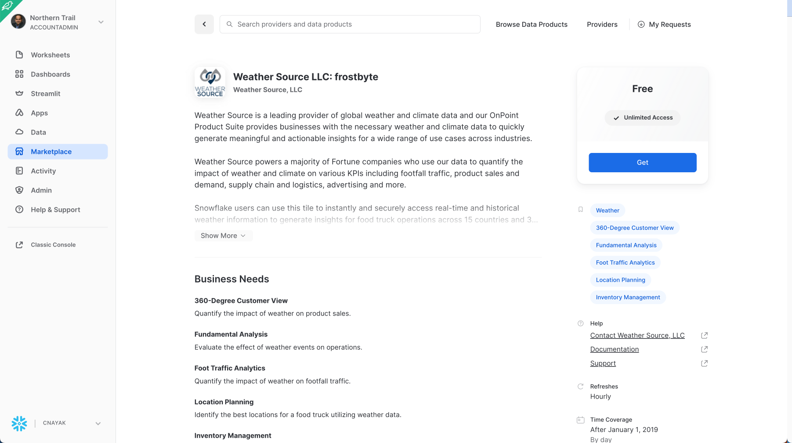

### Set database name to FROSTBYTE_WEATHERSOURCE, grant access to PUBLIC role

 

```sql 
-- Section 4: Step 2 - Harmonizing First and Third Party Data
CREATE OR REPLACE VIEW frostbyte_tasty_bytes.harmonized.daily_weather_v
    AS
SELECT 
    hd.*,
    TO_VARCHAR(hd.date_valid_std, 'YYYY-MM') AS yyyy_mm,
    pc.city_name AS city,
    c.country AS country_desc
FROM frostbyte_weathersource.onpoint_id.history_day hd
JOIN frostbyte_weathersource.onpoint_id.postal_codes pc
    ON pc.postal_code = hd.postal_code
    AND pc.country = hd.country
JOIN frostbyte_tasty_bytes.raw_pos.country c
    ON c.iso_country = hd.country
    AND c.city = hd.city_name;


-- Section 4: Step 3 - Visualizing Daily Temperatures
SELECT 
    dw.country_desc,
    dw.city_name,
    dw.date_valid_std,
    AVG(dw.avg_temperature_air_2m_f) AS avg_temperature_air_2m_f
FROM frostbyte_tasty_bytes.harmonized.daily_weather_v dw
WHERE 1=1
    AND dw.country_desc = 'Germany'
    AND dw.city_name = 'Hamburg'
    AND YEAR(date_valid_std) = '2022'
    AND MONTH(date_valid_std) = '2'
GROUP BY dw.country_desc, dw.city_name, dw.date_valid_std
ORDER BY dw.date_valid_std DESC;


-- Section 4: Step 4 - Bringing in Wind and Rain Metrics
SELECT 
    dw.country_desc,
    dw.city_name,
    dw.date_valid_std,
    MAX(dw.max_wind_speed_100m_mph) AS max_wind_speed_100m_mph
FROM frostbyte_tasty_bytes.harmonized.daily_weather_v dw
WHERE 1=1
    AND dw.country_desc IN ('Germany')
    AND dw.city_name = 'Hamburg'
    AND YEAR(date_valid_std) = '2022'
    AND MONTH(date_valid_std) = '2'
GROUP BY dw.country_desc, dw.city_name, dw.date_valid_std
ORDER BY dw.date_valid_std DESC;

``` 
```sql
/*----------------------------------------------------------------------------------
 Quickstart Section 5 - Democratizing Data Insights
 
  We have now determined that Hurricane level winds were probably at play for the
  days with zero sales that our financial analysts brought to our attention.

  Let's now make these sort of research available to anyone in our organization
  by deploying an Analytics view that all Tasty Bytes employees can access.
----------------------------------------------------------------------------------*/

-- Section 5: Step 1 - Creating SQL Functions
    --> create the SQL function that translates Fahrenheit to Celsius
CREATE OR REPLACE FUNCTION frostbyte_tasty_bytes.analytics.fahrenheit_to_celsius(temp_f NUMBER(35,4))
RETURNS NUMBER(35,4)
AS
$$
    (temp_f - 32) * (5/9)
$$;

    --> create the SQL function that translates Inches to Millimeter
CREATE OR REPLACE FUNCTION frostbyte_tasty_bytes.analytics.inch_to_millimeter(inch NUMBER(35,4))
RETURNS NUMBER(35,4)
    AS
$$
    inch * 25.4
$$;


-- Section 5: Step 2 - Creating the SQL for our View
SELECT 
    fd.date_valid_std AS date,
    fd.city_name,
    fd.country_desc,
    ZEROIFNULL(SUM(odv.price)) AS daily_sales,
    ROUND(AVG(fd.avg_temperature_air_2m_f),2) AS avg_temperature_fahrenheit,
    ROUND(AVG(frostbyte_tasty_bytes.analytics.fahrenheit_to_celsius(fd.avg_temperature_air_2m_f)),2) AS avg_temperature_celsius,
    ROUND(AVG(fd.tot_precipitation_in),2) AS avg_precipitation_inches,
    ROUND(AVG(frostbyte_tasty_bytes.analytics.inch_to_millimeter(fd.tot_precipitation_in)),2) AS avg_precipitation_millimeters,
    MAX(fd.max_wind_speed_100m_mph) AS max_wind_speed_100m_mph
FROM frostbyte_tasty_bytes.harmonized.daily_weather_v fd
LEFT JOIN frostbyte_tasty_bytes.harmonized.orders_v odv
    ON fd.date_valid_std = DATE(odv.order_ts)
    AND fd.city_name = odv.primary_city
    AND fd.country_desc = odv.country
WHERE 1=1
    AND fd.country_desc = 'Germany'
    AND fd.city = 'Hamburg'
    AND fd.yyyy_mm = '2022-02'
GROUP BY fd.date_valid_std, fd.city_name, fd.country_desc
ORDER BY fd.date_valid_std ASC;


-- Section 5: Step 3 - Deploying our Analytics View
CREATE OR REPLACE VIEW frostbyte_tasty_bytes.analytics.daily_city_metrics_v
COMMENT = 'Daily Weather Source Metrics and Orders Data for our Cities'
    AS
SELECT 
    fd.date_valid_std AS date,
    fd.city_name,
    fd.country_desc,
    ZEROIFNULL(SUM(odv.price)) AS daily_sales,
    ROUND(AVG(fd.avg_temperature_air_2m_f),2) AS avg_temperature_fahrenheit,
    ROUND(AVG(frostbyte_tasty_bytes.analytics.fahrenheit_to_celsius(fd.avg_temperature_air_2m_f)),2) AS avg_temperature_celsius,
    ROUND(AVG(fd.tot_precipitation_in),2) AS avg_precipitation_inches,
    ROUND(AVG(frostbyte_tasty_bytes.analytics.inch_to_millimeter(fd.tot_precipitation_in)),2) AS avg_precipitation_millimeters,
    MAX(fd.max_wind_speed_100m_mph) AS max_wind_speed_100m_mph
FROM frostbyte_tasty_bytes.harmonized.daily_weather_v fd
LEFT JOIN frostbyte_tasty_bytes.harmonized.orders_v odv
    ON fd.date_valid_std = DATE(odv.order_ts)
    AND fd.city_name = odv.primary_city
    AND fd.country_desc = odv.country
GROUP BY fd.date_valid_std, fd.city_name, fd.country_desc;

```


```sql 

/*----------------------------------------------------------------------------------
 Quickstart Section 6 - Deriving Insights from Sales and Marketplace Weather Data
 
 With Sales and Weather Data available for all Cities our Food Trucks operate in,
 let's now take a look at the value we have now provided to our Financial Analysts.
----------------------------------------------------------------------------------*/

-- Section 6: Step 1 - Simplifying our Analysis
SELECT 
    dcm.date,
    dcm.city_name,
    dcm.country_desc,
    dcm.daily_sales,
    dcm.avg_temperature_fahrenheit,
    dcm.avg_temperature_celsius,
    dcm.avg_precipitation_inches,
    dcm.avg_precipitation_millimeters,
    dcm.max_wind_speed_100m_mph
FROM frostbyte_tasty_bytes.analytics.daily_city_metrics_v dcm
WHERE 1=1
    AND dcm.country_desc = 'Germany'
    AND dcm.city_name = 'Hamburg'
    AND dcm.date BETWEEN '2022-02-01' AND '2022-02-24'
ORDER BY date DESC;
```
<!-- ------------------------ -->

### Let's Bring Geospatial Data 
[[To skip individual command download tb_geospatial_vhol.sql & create Worksheet to run SQL file]](tb_geospatial_vhol.sql) 

```sql

/*----------------------------------------------------------------------------------
Quickstart Section 3 - Acquiring Safegraph POI Data from the Snowflake Marketplace

 Tasty Bytes operates Food Trucks in numerous cities and countries across the
 globe with each truck having the ability to choose two different selling locations
 per day.  One important item that our Executives are interested in is to learn
 more about how these locations relate to each other as well as if there are any
 locations we currently serve that are potentially too far away from top selling
 city centers.

 Unfortunately what we have seen so far is our first party data does not give us
 the building blocks required to complete this sort of Geospatial analysis.
 
 Thankfully, the Snowflake Marketplace has great listings from Safegraph that 
 can assist us here.
----------------------------------------------------------------------------------*/

-- Section 3: Step 1 - Using First Party Data to Find Top Selling Locations
USE ROLE tasty_data_engineer;
USE WAREHOUSE tasty_de_wh;

SELECT TOP 10
    o.location_id,
    SUM(o.price) AS total_sales_usd
FROM frostbyte_tasty_bytes.analytics.orders_v o
WHERE 1=1
    AND o.primary_city = 'Paris'
    AND YEAR(o.date) = 2022
GROUP BY o.location_id
ORDER BY total_sales_usd DESC;
```


```
-- Section 3: Step 2 - Acquiring Safegraph POI Data from the Snowflake Marketplace 
/*--
    - Click -> Home Icon
    - Click -> Marketplace
    - Search -> frostbyte
    - Click -> SafeGraph: frostbyte
    - Click -> Get
    - Rename Database -> FROSTBYTE_SAFEGRAPH (all capital letters)
    - Grant to Additional Roles -> PUBLIC
--*/

```
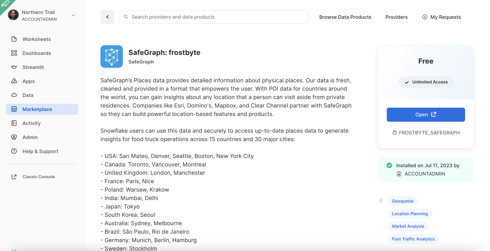 
```sql

-- Section 3: Step 3 - Evaluating Safegraph POI Data
SELECT 
    cpg.placekey,
    cpg.location_name,
    cpg.longitude,
    cpg.latitude,
    cpg.street_address,
    cpg.city,
    cpg.country,
    cpg.polygon_wkt
FROM frostbyte_safegraph.public.frostbyte_tb_safegraph_s cpg
WHERE 1=1
    AND cpg.top_category = 'Museums, Historical Sites, and Similar Institutions'
    AND cpg.sub_category = 'Museums'
    AND cpg.city = 'Paris'
    AND cpg.country = 'France';


/*----------------------------------------------------------------------------------
Quickstart Section 4 - Harmonizing and Promoting First and Third Party Data

 To make our Geospatial analysis seamless, let's make sure to get Safegraph POI
 data included in the analytics.orders_v so all of our downstream users can
 also access it.
----------------------------------------------------------------------------------*/

-- Section 4: Step 1 - Enriching our Analytics View
USE ROLE sysadmin;

CREATE OR REPLACE VIEW frostbyte_tasty_bytes.analytics.orders_v
COMMENT = 'Tasty Bytes Order Detail View'
    AS
SELECT 
    DATE(o.order_ts) AS date,
    o.* ,
    cpg.* EXCLUDE (location_id, region, phone_number, country)
FROM frostbyte_tasty_bytes.harmonized.orders_v o
JOIN frostbyte_safegraph.public.frostbyte_tb_safegraph_s cpg
    ON o.location_id = cpg.location_id;


/*----------------------------------------------------------------------------------
Quickstart Section 5 - Conducting Geospatial Analysis - Part 1

 With Point of Interest metrics now readily available from the Snowflake Marketplace
 without any ETL required, our Tasty Bytes Data Engineer can now begin on our
 Geospatial analysis journey.
----------------------------------------------------------------------------------*/    

-- Section 5: Step 1 - Creating a Geography Point
USE ROLE tasty_data_engineer;

SELECT TOP 10 
    o.location_id,
    ST_MAKEPOINT(o.longitude, o.latitude) AS geo_point,
    SUM(o.price) AS total_sales_usd
FROM frostbyte_tasty_bytes.analytics.orders_v o
WHERE 1=1
    AND o.primary_city = 'Paris'
    AND YEAR(o.date) = 2022
GROUP BY o.location_id, o.latitude, o.longitude
ORDER BY total_sales_usd DESC;


-- Section 5: Step 2 - Calculating Distance Between Locations
WITH _top_10_locations AS 
(
    SELECT TOP 10
        o.location_id,
        ST_MAKEPOINT(o.longitude, o.latitude) AS geo_point,
        SUM(o.price) AS total_sales_usd
    FROM frostbyte_tasty_bytes.analytics.orders_v o
    WHERE 1=1
        AND o.primary_city = 'Paris'
        AND YEAR(o.date) = 2022
    GROUP BY o.location_id, o.latitude, o.longitude
    ORDER BY total_sales_usd DESC
)
SELECT
    a.location_id,
    b.location_id,
    ROUND(ST_DISTANCE(a.geo_point, b.geo_point)/1609,2) AS geography_distance_miles,
    ROUND(ST_DISTANCE(a.geo_point, b.geo_point)/1000,2) AS geography_distance_kilometers
FROM _top_10_locations a  
JOIN _top_10_locations b
    ON a.location_id <> b.location_id -- avoid calculating the distance between the point itself
QUALIFY a.location_id <> LAG(b.location_id) OVER (ORDER BY geography_distance_miles) -- avoid duplicate: a to b, b to a distances
ORDER BY geography_distance_miles;


/*----------------------------------------------------------------------------------
Quickstart Section 6 - Conducting Geospatial Analysis - Part 1

 Now that we understand how to create points, and calculate distance, we will now
 pile on a large set additional Snowflake Geospatial functionality to further our
 analysis.
----------------------------------------------------------------------------------*/   

-- Section 6: Step 1 - Collecting Points, Drawing a Minimum Bounding Polygon and Calculating Area
WITH _top_10_locations AS 
(
    SELECT TOP 10
        o.location_id,
        ST_MAKEPOINT(o.longitude, o.latitude) AS geo_point,
        SUM(o.price) AS total_sales_usd
    FROM frostbyte_tasty_bytes.analytics.orders_v o
    WHERE 1=1
        AND o.primary_city = 'Paris'
        AND YEAR(o.date) = 2022
    GROUP BY o.location_id, o.latitude, o.longitude
    ORDER BY total_sales_usd DESC
)
SELECT
    ST_NPOINTS(ST_COLLECT(tl.geo_point)) AS count_points_in_collection,
    ST_COLLECT(tl.geo_point) AS collection_of_points,
    ST_ENVELOPE(collection_of_points) AS minimum_bounding_polygon,
    ROUND(ST_AREA(minimum_bounding_polygon)/1000000,2) AS area_in_sq_kilometers
FROM _top_10_locations tl;


-- Section 6: Step 2 - Finding our Top Selling Locations Center Point
WITH _top_10_locations AS 
(
    SELECT TOP 10
        o.location_id,
        ST_MAKEPOINT(o.longitude, o.latitude) AS geo_point,
        SUM(o.price) AS total_sales_usd
    FROM frostbyte_tasty_bytes.analytics.orders_v o
    WHERE 1=1
        AND o.primary_city = 'Paris'
        AND YEAR(o.date) = 2022
    GROUP BY o.location_id, o.latitude, o.longitude
    ORDER BY total_sales_usd DESC
)
SELECT  
    ST_COLLECT(tl.geo_point) AS collect_points,
    ST_CENTROID(collect_points) AS geometric_center_point
FROM _top_10_locations tl;


-- Section 6: Step 3 - Setting a SQL Variable as our Center Point
SET center_point = '{
  "coordinates": [
    2.364853294993676e+00,
    4.885681511418426e+01
  ],
  "type": "Point"
} ';


-- Section 6: Step 4 - Finding Locations Furthest Away from our Top Selling Center Point
WITH _2022_paris_locations AS
(
    SELECT DISTINCT 
        o.location_id,
        o.location_name,
        ST_MAKEPOINT(o.longitude, o.latitude) AS geo_point
    FROM frostbyte_tasty_bytes.analytics.orders_v o
    WHERE 1=1
        AND o.primary_city = 'Paris'
        AND YEAR(o.date) = 2022
)
SELECT TOP 50
    ll.location_id,
    ll.location_name,
    ROUND(ST_DISTANCE(ll.geo_point, TO_GEOGRAPHY($center_point))/1000,2) AS kilometer_from_top_selling_center
FROM _2022_paris_locations ll
ORDER BY kilometer_from_top_selling_center DESC;


/**********************************************************************/
/*------               Quickstart Reset Scripts                 ------*/
/*------   These can be ran to reset your account to a state    ------*/
/*----- that will allow you to run through this Quickstart again -----*/
/**********************************************************************/

UNSET center_point;

USE ROLE sysdmin;


DROP DATABASE IF EXISTS frostbyte_safegraph;
```

### 

## Login to Tableau Online & Connect to Snowflake

Duration: 30

Navigate to https://online.tableau.com/ and login to Tableau Cloud (Online) using your login credentials.

 

<br>

You will be redirected to the Tableau Cloud (Online) Home page. Within the blue “Welcome to your Tableau site” banner, click into the “New” dropdown and select “Workbook”.

 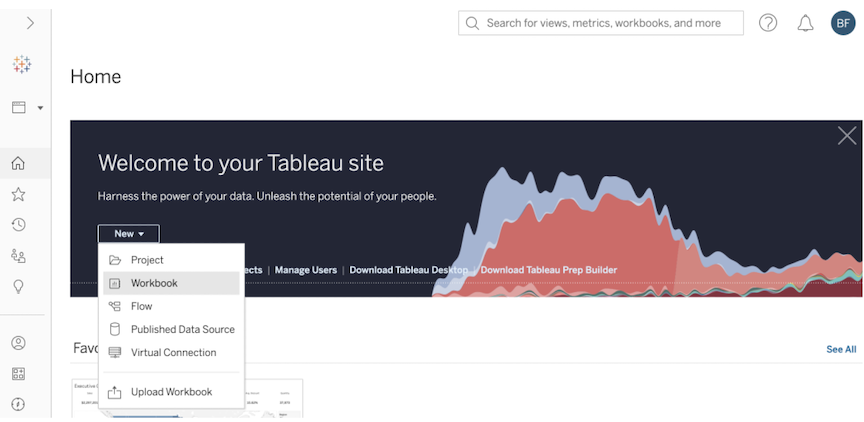

<br>

You will be automatically prompted to connect to a data source. Within the “Connect to Data” popup window, select “Connectors”. Find *Snowflake* in the grid.
Note: you may need to use the horizontal bottom scrollbar at the bottom of the window and scroll to the right of the “Connections" tab.

 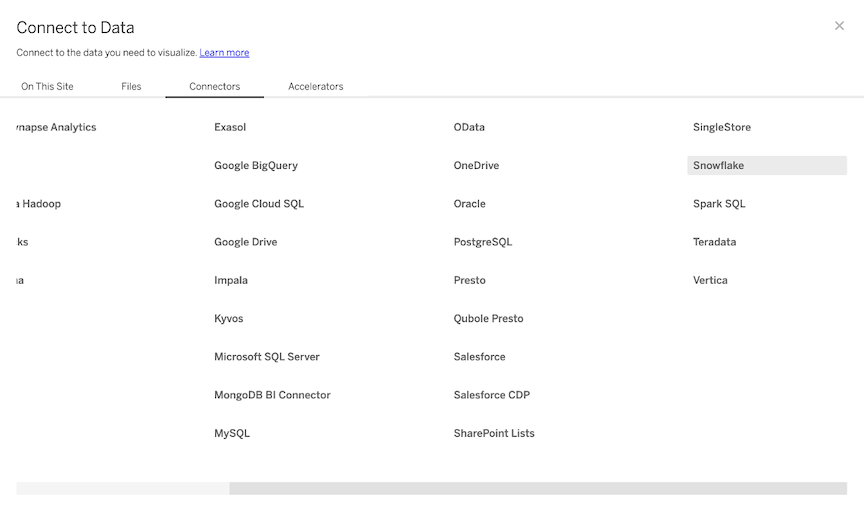

<br>

Enter the Server name. Note that you will need to remove the 'https://' from the name (see screenshot). You can find the server name [insert instructions here] Change the authentication method to username/password, enter your credentials & then click the blue “Sign in” button.

 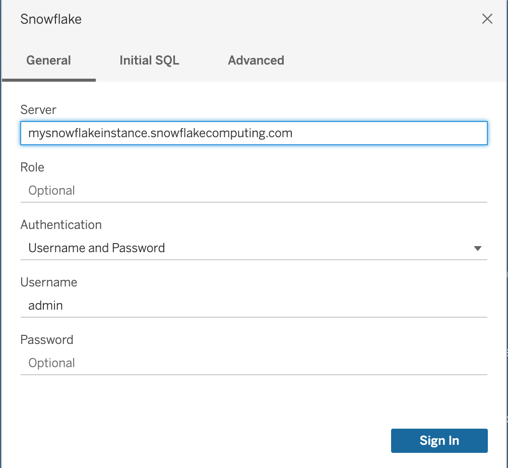

<br>

Within the connections pane, make the following selections:

* Warehouse: your warehouse
* Database: FROSTBYTE_TASTY_BYTES
* Schema: ANALYTICS


A list of tables will appear:

 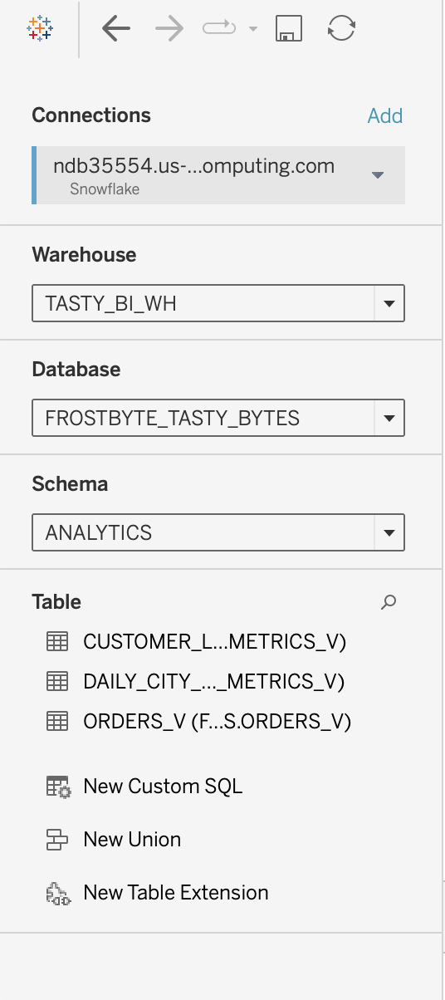


<br>

Click and drag the 'ORDERS_V' table where it says “Drag tables here”.

<br>

Next, click and drag the 'DAILY_CITY_WEATHER_V' to the Canvas. This will create a relationship. In Tableau, a relationship is a flexible way to do multi-table analysis without creating one large flat table. Make sure that the fields are mapped correctly by matching 'Date' and 'Date' and matching 'City Name' and 'City'.

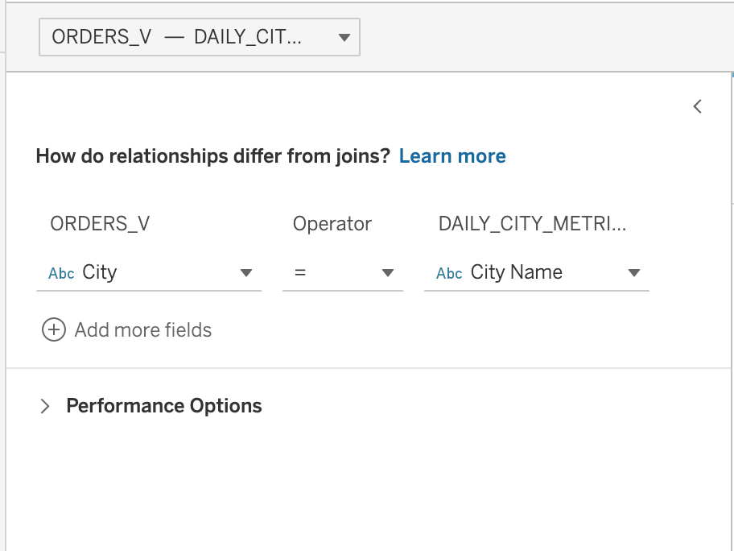

<!-- ------------------------ -->

<!-- ------------------------ -->

<br>

## Configure Data Source Filters

By adding data source filters, we can exclude any outliers that may hinder performance or skew our data. 

In the top right corner of the screen, locate where it says “Filters”. Under “Filters”, there is a button that says “Add”. Click the “Add” button.

 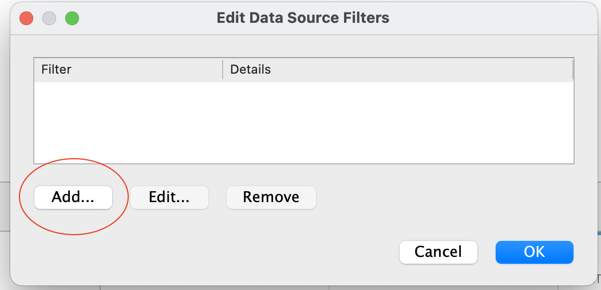

<br>

On the bottom left of the pop-up “Edit Data Source Filters” window, click “Add Filter”.

 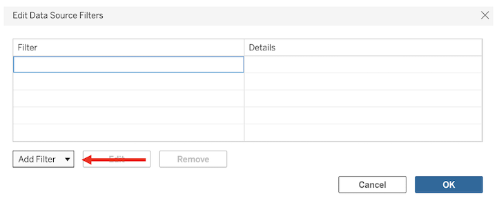

<br>

Within the pop-up, start typing “Date”. Click the “Date” field.

<br>

When the options for different types of date filters appear, click “Relative Date”, then click “Years” and change the criteria to 'Last 2 Years'. After that, click the blue “OK” button in the bottom right of the pop-up. Then click 'OK' once you see the list of all data source filters.

 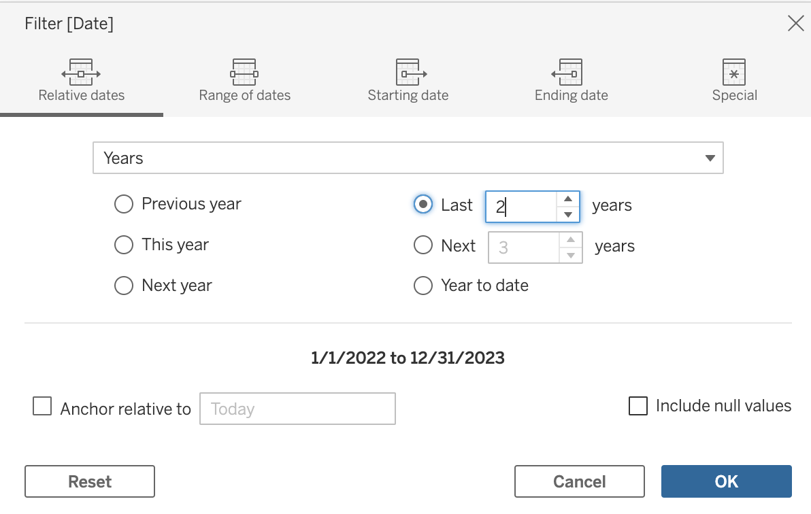

<br>


<br>

<!-- ------------------------ -->

<!-- ------------------------ -->

<br>

## Visualize Data

Now we are ready to visualize our data! In the bottom left of the screen, click “Sheet 1”.

 

<br>

Let's start by visualizing the Sales Data for each city over time. Find the 'Order Total' Field on the left hand pane under the 'Orders_V' table dropdown, and double click the field. This will automatically add the field to the canvas, and visualize it in the most optimal way. In this case, it will sum up the Order Totals and present it in a bar chart. If we translated this to SQL, it would be 'select sum(Order_Totals) from orders_v'.

 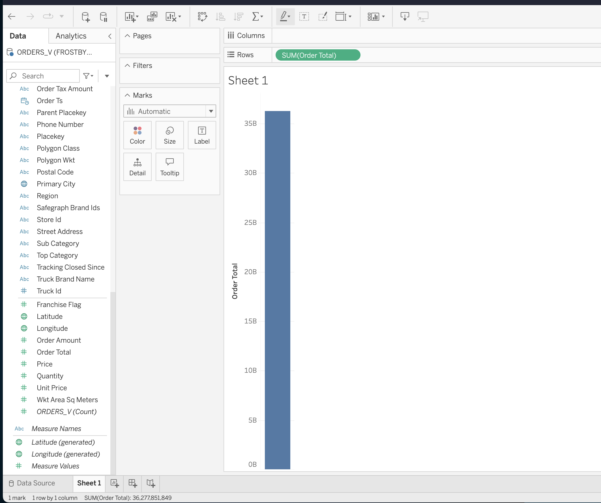

<br>

Now, lets start to bucket or group the order totals by another metric. We'll use date in this case. Drag the Date field from the Orders_v table on the left hand side to the Columns shelf. You'll see that Tableau automatically aggregates dates up to the year level first. Let's change that to a more granular aggregation, since we are only working with 2 years of data.

 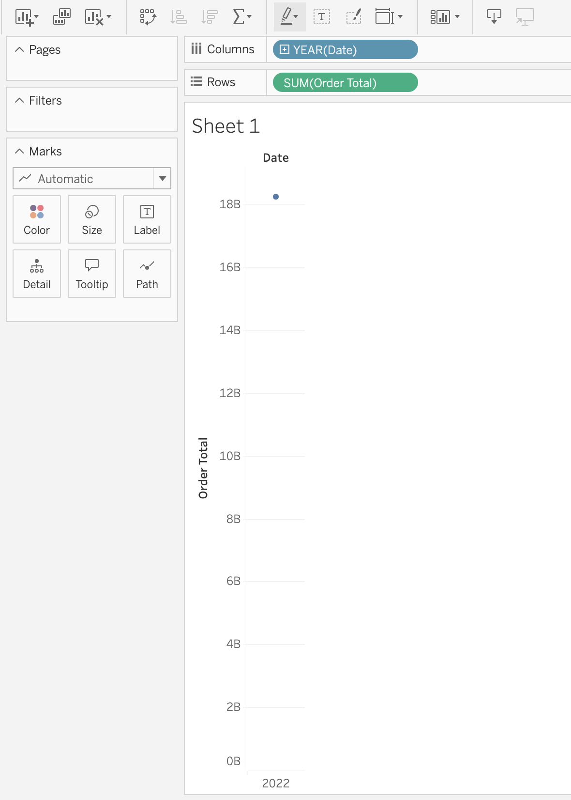


By clicking the blue pill that says 'Year(Date)', we can see multiple options for aggregating the date. The first set of year/month/day will aggregate in a discrete manner. For example, if we selected 'Month', Tableau would aggregate the Order Totals for all the months of 2021, Jan 2022, Jan 2023, etc. The second set of 'year/month/day' will create a continuous time series of order totals. Let's select 'Week Number' from the 2nd set. You'll see a line chart appear with data on Order Totals from 2022-2023.

 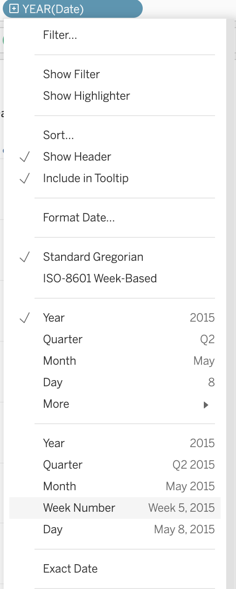
 <br>
 
<br>

Now, Finally, lets split out the line chart further and break it down by City. We can add a third field to the visualization by adding 'City' to Color on the marks card. This will break out the data by each city and assign it a different color. You'll see the legend on the right hand side pop up. Let's also rename this sheet by clicking on the 'Sheet 1' label on the bottom bar and renaming it 'City Sales by Week'.

 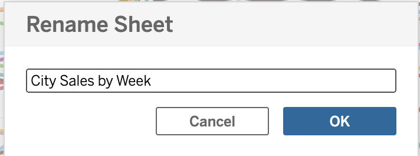

<br>

Looking at this line graph, here's more than one city with a massive drop in sales in March. These are Berlin, New York City, and Hamburg (Hamburg which we already visualized in snowflake). Let's add a filter so that I can narrow it down to those three cities. Drag the 'City' field to the filters card. When the filter card pops up, select just a few cities, including Berlin, NYC and Hamburg. Paris had a few fluctuations in sales as well, so we can select the field as well.

 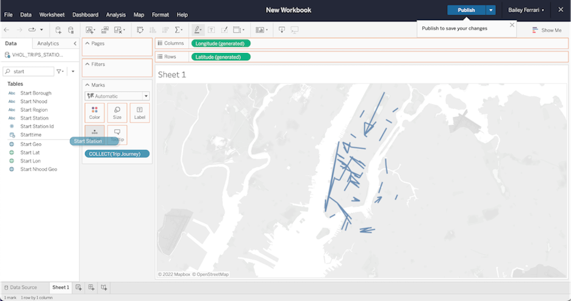

<br>

Great. Let's see if they also had high wind speed during those days and months with lower sales. Duplicate the sheet by right-clicking the bar along the bottom and selecting 'Duplicate'. Then, make sure that max wind speed is averaged by right clicking the field and selecitng 'Data properties' -> 'Aggregation' -> Avg. Then, drag out the 'Max Wind Speed' field to Rows. This may take a few minutes to render.


<br>

We can see that the avg wind speed does seem to have somewhat of a negative correlation with order totals. In order to further investigate the pattern, we can actually very quickly check the trends of the lines by reversing the axis. Right-click the y-axis for the wind speed, go to 'Edit Axis' and checked the 'reversed' box. You may expect the wind speed line to look similar to the Order Totals line.

  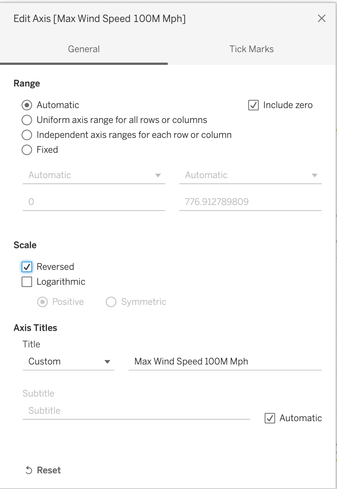

<br>

It doesn't seem to look very similar, and there's also some null values - NYC has no wind speed data. We can make a note to ask my data engineers about that later. For now, let's focus on the orders table of data and see what else we can glean.

Let's look at truck performance across all cities. To do that, we'll measure performance by total sales, or 'Order Total' field. Drag out the 'Order Total' field onto the columns shelf. Then, click and drag 'Truck Name' to the rows shelf. Rename the sheet 'Food Truck Performance by Total Revenue'.

Lastly, we want to see some of the top products. We'll measure by the quantity ordered. Open a new sheet, then drag 'Quantity' out onto the columns shelf. Drag 'Menu Item Name' onto the rows shelf. Then,  exclude the top to items, Bottled Soda and Bottled Water, since they are constants at every food truck. Do that by using command-click on both of the items, then selecting 'Exclude'.

Let's also change the way the data is visualized. A bar chart is great, but ultimately, since the numbers are so high, the differences in bar lengths are a difficult to gague. we also need to add a label so that we can see the nuances between some of the top selling products. Drag another copy of sum(Quantity) to the label square on the marks card to add more detail.

Next up we'll filter to just the top 10 products. To do that, drag 'Menu Item Name' from the data pane to the filters card. Navigate to the 'Top' tab and select 'By Field', then make sure that the filter grabs the top 10 by quantity. Rename the sheet 'Top Selling Menu Items'.

Let's filter the truck performance to the top 5 trucks. Do the same thing as for products, but just grab the top 5 by Order Total for truck names.

<!-- ------------------------ -->

<!-- ------------------------ -->

<br>

## Create a Dashboard

We have all of this information, but lets put it all together to see if we can gain insights from looking at all of the separate information in one place. Click on the waffle icon in the bottom bar to create a new dashboard.

Just like fields dragged onto the canvas, you can drag sheets onto the dashboard to compose them. Let's drag our Time series with just order totals out, then drag out 'Top Selling Products' and 'Food Truck Performance by Total Revenue' sheets. Finally, in order to make sure the filters carry over, apply the City filter to all sheets using this data source. To do that, simply click the carrot icon on the selected City filter, then click 'Apply to Worksheets' -> 'All using this datasource'. 

 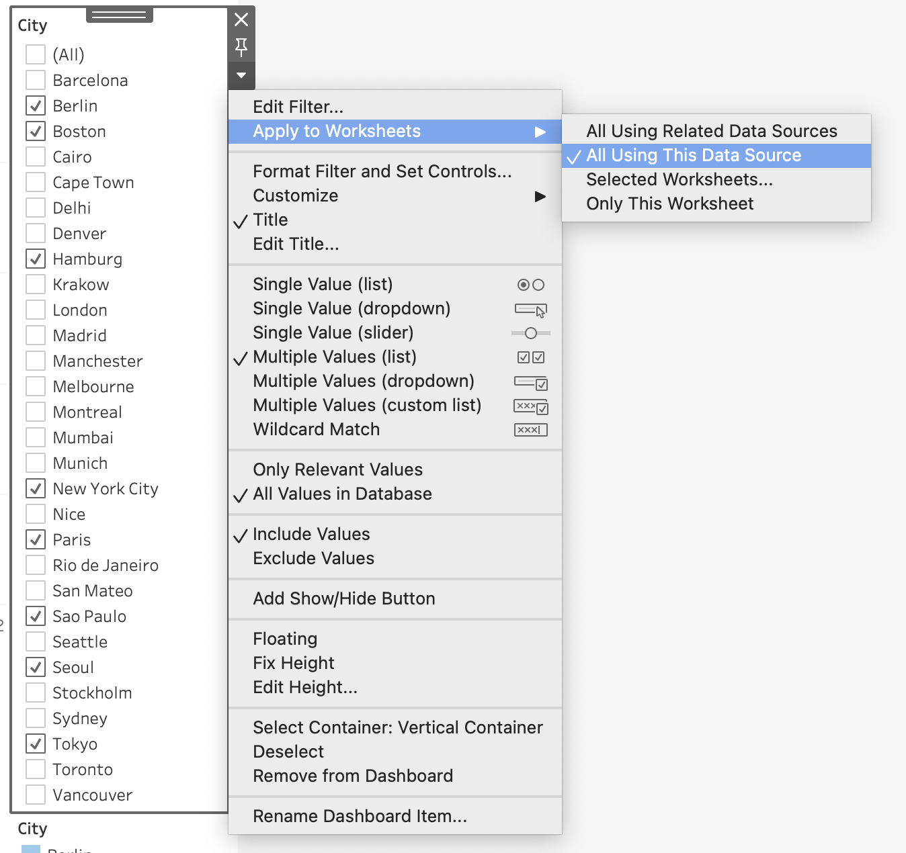

Interesting. The most frequently sold items are not part of the top food truck's menu. Next, we might want to speak to the data engineers on the Snowflake team to add profit to the data source for future analysis on most profitable items. Rename the dashboard 'Tasty Bytes Sales Analysis'. Let's publish this dashboard to share this insight and feedback with others.

<br>


### Publish Dashboards and Create Data


### Embed the Dashboard into a Web Page

Click the white “Share” button at the top right of the screen.

 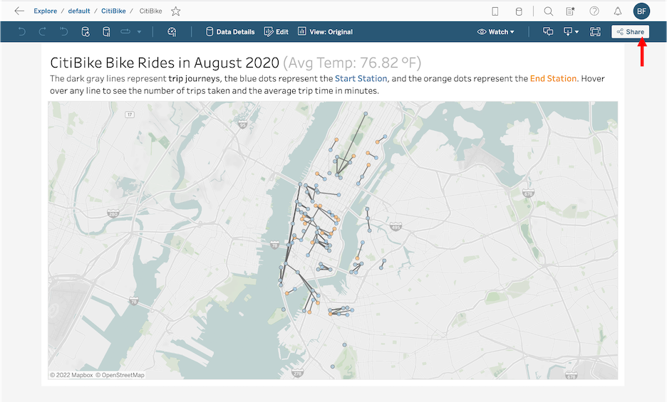

<br>

Under “Share using a link”, click “Copy Link”.

 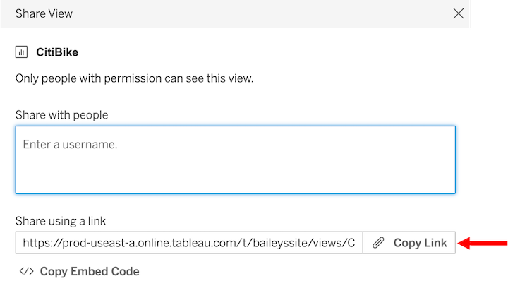

<br>

As a prerequisite, you were instructed to download a text editor called Visual Studio Code (VS Code). Open that Application.

 

<br>

Locate the  “Tableau Embedded Portal” folder we provided at the begging on this lab.

 

<br>

Open the “Tableau Embedded Portal” folder in VS Code by clicking “Open” on the “Get Started” window and then selecting the folder name, or by simply dragging the folder into the VS Code window.

 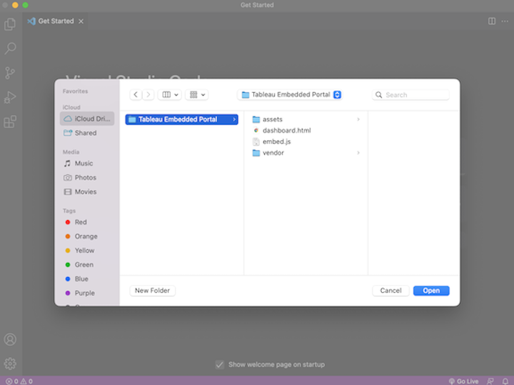

<br>

Once you’ve opened the folder in VS Code, you’ll notice two key files: dashboard.html and embed.js. Within the lefthand “Explorer” pane, click to open the *embed.js* file.

 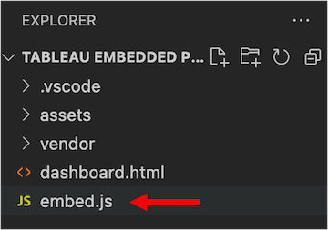

<br>

On line 8 where the annotations prompt you to “PASTE LINK HERE“, paste the embed link we copied from Tableau Online. After pasting, save your changes using File → Save.

 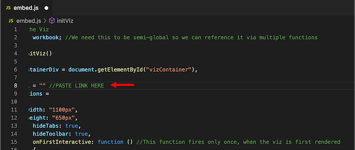

<br>

Now within the “Explorer” pane, right click on “dashboard.html” and select “Open in Default Browser” from the drop-down menu. This will open the webpage you just embedded your Tableau dashboard into.

 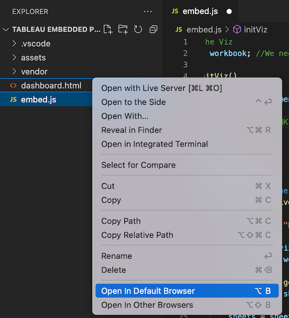

<br>

Now we can not only view our Tableau dashboard within an external webpage, but we can actually interact with it!

 

<br>

Remember when we added the “Start Borough” field into our worksheet in Tableau Online? By doing that, we told Tableau we want to use that field as a filter. This enables us to leverage Tableau’s JavaScript API to translate the selections we make within a webpage into filters within Tableau.

In the left pane of the webpage, click “Start Borough”. Select “Brooklyn” within the “Start Boroughs” filter menu. That selection will be passed into Tableau.

 

<br>

The dashboard will zoom and filter, showing us only trips that started in Brooklyn.

 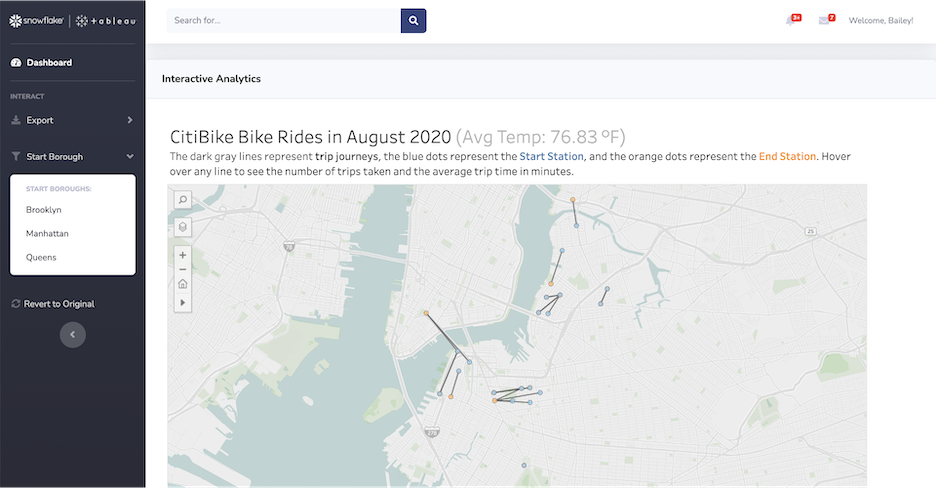

<br>

<!-- ------------------------ -->

<!-- ------------------------ -->

<br>

<!-- ------------------------ -->


## Conclusion

Congratulations! you have completed the lab.

In this lab we captured semi-structured data coming from TastyBytes food truck data, enriched that data with geospatial data, and weather data from  Snowflake Data marketplace data to find correlation between food sales and weather. We visualized the data using Tableau to quickly arrive at relevant insights.

[Semi-structured Data](https://docs.snowflake.com/en/user-guide/semistructured-concepts.html)
<br>
</br>
[Secure Data Sharing](https://docs.snowflake.com/en/user-guide/data-sharing-intro.html)
<br>
</br>
[Snowflake Data Marketplace](https://other-docs.snowflake.com/en/data-marketplace.html)
<br></br>

### Video on the Demo

[Youtube - Video on the Demo](https://www.youtube.com/watch?v=9zMtimcooxo)
<!-- ------------------------ -->

<br>
